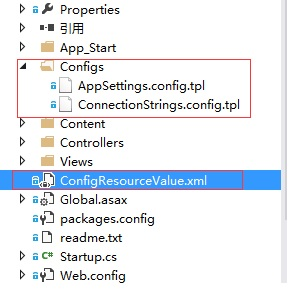
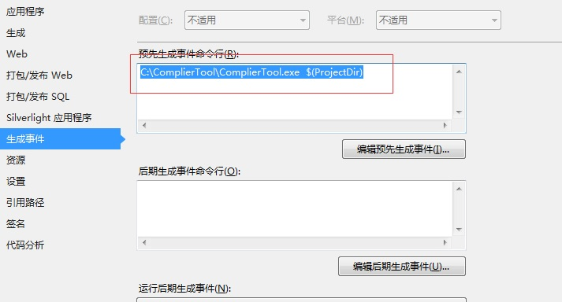

# ComplierTool是什么，能够解决什么问题

ComplierTool 产生Config文件的工具。主要是解决一个项目要在几个环境之间进行切换，然后配置文件老是进行人工的修改调整，ComplierTool 默认支持`Development`,`Testing`,`PreOnline`,`Online`四个环境，即开发、测试、预上线、线上。

[下载ComplierTool](BinaryZipForWindows/ComplierTool.rar)

# ComplierTool 在项目中的使用

* 项目结构图，框了红圈的是必须的内容



* __必须文件及其格式__

根目录下必须有文件 `ConfigResourceValue.xml` 以及文件夹 `Configs`;Configs中放置的文件名必须是 xxx.tpl，xxxx会是最后生成出的文件名

* 看看 `ConfigResourceValue.xml`的内容吧,`注意Development、Testing、PreOnline、Online四个环境节点的子几点数必须一样，子节点名称也必须相同`

```xml
<?xml version="1.0" encoding="utf-8" ?>
<ConfigResourceValueRoot>
  <Environments>
    <Environment Name="Development"/> 
    <Environment Name="Testing"/>
    <Environment Name="PreOnline"/>
    <Environment Name="Online"/>
  </Environments>
  <ConfigResourceValues>
    <!--开发环境-->
    <Development>
      <defaultConnection>Data Source=127.0.0.1;Initial Catalog=Student;Integrated Security=false;User ID=sa;Password=xxxx</defaultConnection>
      <loginPathController>Account</loginPathController>
    </Development>
    <!--测试环境-->
    <Testing>
      <defaultConnection>Data Source=127.0.0.1;Initial Catalog=Student;Integrated Security=false;User ID=sa;Password=xxxx</defaultConnection>
      <loginPathController>Account</loginPathController>
    </Testing>
    <!--上线前环境-->
    <PreOnline>
      <defaultConnection>Data Source=127.0.0.1;Initial Catalog=Student;Integrated Security=false;User ID=sa;Password=xxxx</defaultConnection>
      <loginPathController>Account</loginPathController>
    </PreOnline>
    <!--线上环境-->
    <Online>
      <defaultConnection>Data Source=127.0.0.1;Initial Catalog=Student;Integrated Security=false;User ID=sa;Password=xxxx</defaultConnection>
      <loginPathController>Account</loginPathController>
    </Online>
  </ConfigResourceValues>
</ConfigResourceValueRoot>
```

* 看看tpl文件，也就是配置模板文件,`AppSettings.config.tpl`,`ConnectionStrings.config.tpl`,`$xxx$`中的xxx即为`ConfigResourceValue.xml` 中的节点名称，`$xxx$` 最后会被替代为 xxx节点中的值

```xml
<?xml version="1.0" encoding="utf-8" ?>
<appSettings>
  <add key="LoginPathController" value="$loginPathController$" />
</appSettings>
```

```xml
<?xml version="1.0" encoding="utf-8" ?>
<connectionStrings>
  <add name="DefaultConnection" connectionString="$defaultConnection$" providerName="System.Data.SqlClient" />
</connectionStrings>

```

* 看看我们关心的 `Web.config` 文件,这里我们关注 `connectionStrings` 与 `appSettings` 节点的 `configSource`属性

```xml
<?xml version="1.0" encoding="utf-8"?>
<configuration>
  <connectionStrings configSource="Configs\ConnectionStrings.config">
  </connectionStrings>
  <appSettings configSource="Configs\AppSettings.config">
  </appSettings>
  <system.web>
    <compilation debug="true" targetFramework="4.5" />
    <httpRuntime targetFramework="4.5" />
  </system.web>
  <runtime>
    <assemblyBinding xmlns="urn:schemas-microsoft-com:asm.v1">
      <dependentAssembly>
        <assemblyIdentity name="System.Web.Helpers" publicKeyToken="31bf3856ad364e35" />
        <bindingRedirect oldVersion="1.0.0.0-3.0.0.0" newVersion="3.0.0.0" />
      </dependentAssembly>
      <dependentAssembly>
        <assemblyIdentity name="System.Web.WebPages" publicKeyToken="31bf3856ad364e35" />
        <bindingRedirect oldVersion="1.0.0.0-3.0.0.0" newVersion="3.0.0.0" />
      </dependentAssembly>
      <dependentAssembly>
        <assemblyIdentity name="System.Web.Mvc" publicKeyToken="31bf3856ad364e35" />
        <bindingRedirect oldVersion="1.0.0.0-5.2.3.0" newVersion="5.2.3.0" />
      </dependentAssembly>
    </assemblyBinding>
  </runtime>
<system.webServer>
    <handlers>
      <remove name="ExtensionlessUrlHandler-Integrated-4.0" />
      <remove name="OPTIONSVerbHandler" />
      <remove name="TRACEVerbHandler" />
      <add name="ExtensionlessUrlHandler-Integrated-4.0" path="*." verb="*" type="System.Web.Handlers.TransferRequestHandler" preCondition="integratedMode,runtimeVersionv4.0" />
    </handlers>
  </system.webServer>
</configuration>
```

# 最后的项目配置




# ComplierTool 工具放置的位置

在上面的项目配置中，我们就清楚的看到了ComplierTool放置的位置了

# 后续期望

希望后续版本改进为 `Visual Studio` 的插件方式